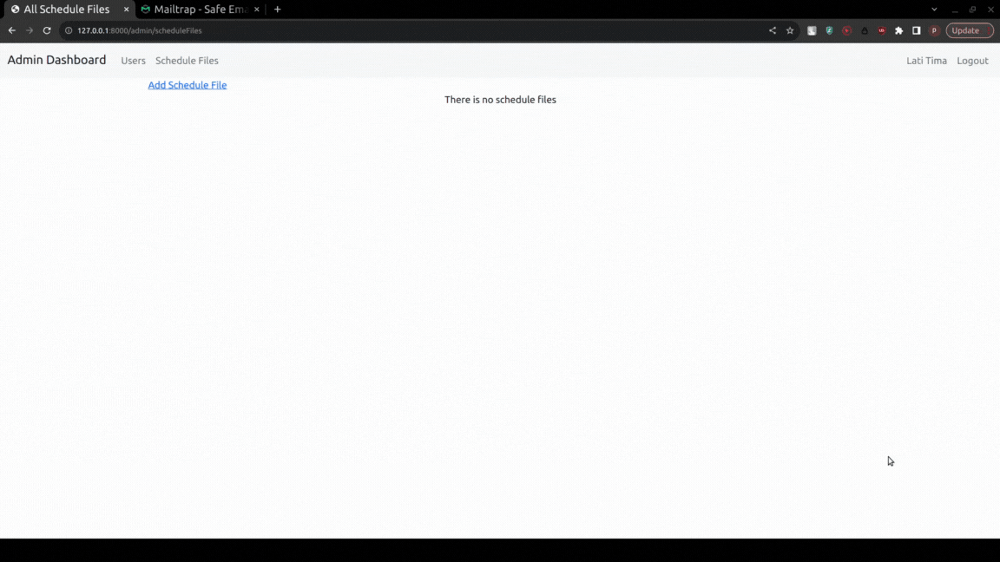

## Installation
<ol>
  <li>composer install</li>
  <li>composer dump-autoload</li>
  <li>touch .env</li>
  <li>Coppy text from .env.example to .env</li>
  <li>php artisan key:generate</li>
  <li>php artisan cache:clear </li>
  <li>php artisan config:clear</li>
  <li>set up database</li>
</ol>

## Previews of Email Notification
</img>

</img>

